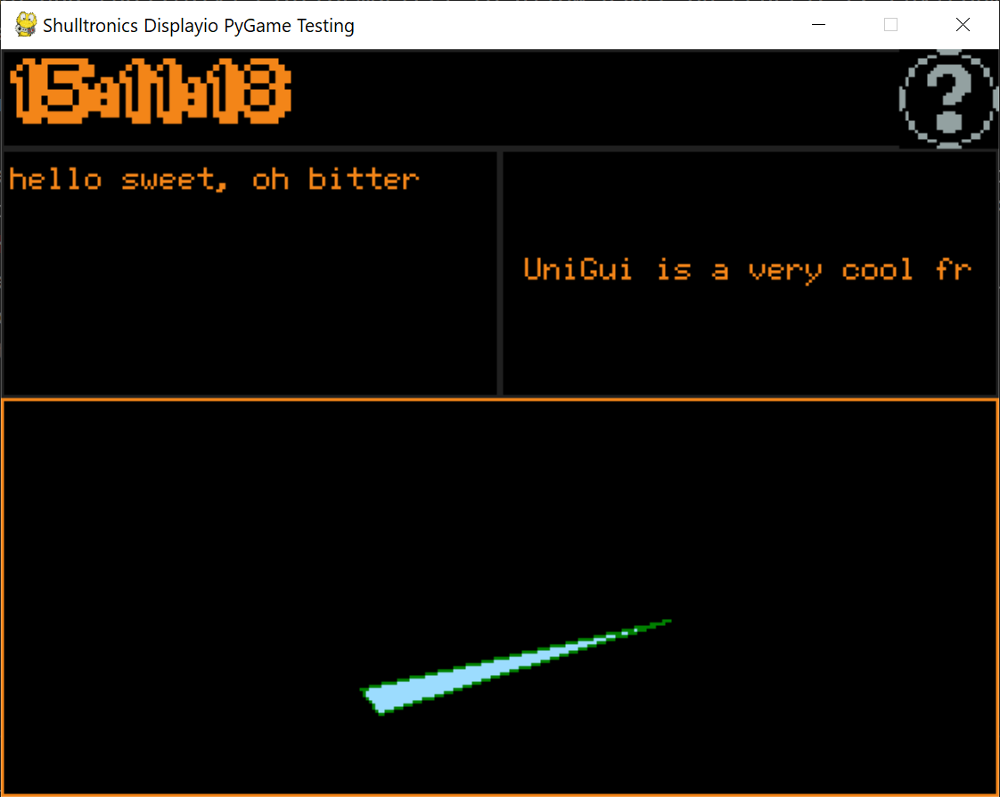

# UniGui

### A cross-platform user interface framework based on Adafruit Displayio

This GUI framework can be used to create front-ends on multiple platforms, including Generic Linux and Windows PCs, Single board computers such as Raspberry Pi using a hardware display (for instance: PiTFT), and microcontroller-based projects (i.e. Feather RP2040) using CircuitPython and a display.

There is also a class called `PygameDisplay` that uses pygame to create a `displayio.Display` for use in a non-embedded environment. Much of that code was adopted from https://github.com/FoamyGuy/Blinka_Displayio_PyGameDisplay.

## ToDo list
- [ ] PR for Adafruit_Blinka and (possibly) PlatformDetect to allow usage on generic PC environments.
- [ ] Overall improvement and features for widgets
- [ ] Fix border_on function for generic widget so border is always drawn on top of other content (useful for viewing widget dimensions)
- [ ] Map names (such as BASE_DARK, BASE_LIGHT, TEXT_DEFAULT, TEXT_HIGHLIGHT, etc) to the palette indices so that I can reference them independently of the color scheme
- [ ] Figure out how to better handle clicks. For example, I might want a single widget to have multiple click regions. I don't think this is easy to do right now. Consider removing UniGui object totally and just making the Widget idea fully recursive.
- [ ] Fix font file paths so they work always

## How to use this framework
- Clone this repository to your computer, then navigate into the project directory.
- Create a python virtual environment with `python -m venv .venv`. Note: This project has been tested with Python 3.10.4 on Windows and Linux. You can name your virtual environment directory whatever you like. The current `.gitignore` will ignore all directories starting with `.venv`
- Activate the virtual environment on Linux with `source .venv/bin/activate.sh`, or on Windows PowerShell with `.venv\Scripts\Activate.ps1`.
- Install dependencies with `pip install -r requirements.txt`.
- Until an issue is resolved with running Adafruit Blinka on generic PC environments (PR#xxx), it's necessary to use my fork of Adafruit_Blinka, copy and paste the `microcontroller` directory into the virtual environment site-packages directory.
- To run the examples, install the package into the virtual environment with `pip install -e .`.